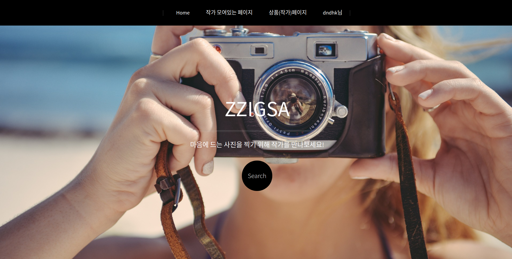

# ZZIGSA

사진 작가를 위한 웹 사이트입니다.

* * *
# Specification

### 템플릿 상속은 했으나 product는 캐러셀이 달라 따로 생각해 주어야 하며
    
### login fornt page는  중복되는 부분이 적어 상속을 하지 않음.

### email, social login 확인할 것.

### 개인정보 수정, 비밀번호 수정 구현할 것.
* * *
## Installation
    1. pip install -r requirements.txt
    
    2. python manage.py runserver
* * *
## 패키지 환경 관리
    requirements 만들 때 : pip freeze > requirements.txt

    requirements 설치할 때 : pip install -r requirements.txt